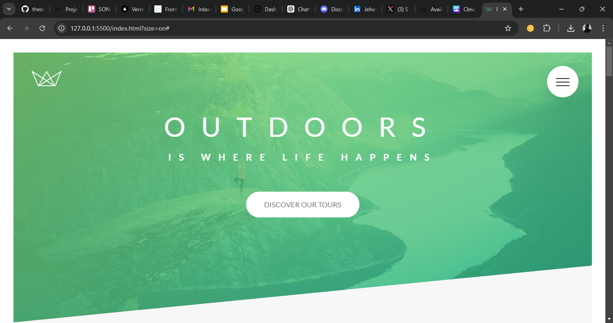

# Natours 🌍

Welcome to **Natours**, a tourism website that offers an immersive and interactive experience to explore amazing travel destinations across the world. Built with modern web technologies, including **Sass** for styling, Natours provides a seamless and visually appealing experience for users.

## Table of Contents

- [Demo](#demo)
- [Features](#features)
- [Tech Stack](#tech-stack)
- [Installation](#installation)
- [Usage](#usage)
- [Contributing](#contributing)
- [License](#license)
- [Screenshots](#screenshots)

## Demo

Check out the live demo [here](https://natours-byone.vercel.app/).

## Features

- Responsive design for mobile and desktop
- Smooth animations and transitions
- Dynamic content and interactive elements
- Eye-catching UI with modern design principles
- Easy navigation through various destinations

## Tech Stack

- **HTML5**: Structure and content
- **Sass (CSS Preprocessor)**: Efficient and modular styling
- **JavaScript (ES6+)**: Dynamic functionality and interactivity(Soon to be Implemented.)

## Installation

To run this project locally, follow these steps:

1. Clone the repository:

   ```bash
   git clone https://github.com/thesongmartins/Natours.git
   ```

2. Navigate into the project directory:

   ```bash
   cd naatours
   ```

3. Install dependencies:

   ```bash
   npm install
   ```

4. Compile Sass:

   ```bash
   npm run sass
   ```

5. Start the development server:
   ```bash
   npm start
   ```

## Usage

After installing and starting the server, you can access the website at:
http://localhost:3000

Explore the homepage and navigate through different destinations and services offered by **Natours**. The website provides a user-friendly interface to explore travel options.

## Contributing

We welcome contributions! Here's how you can help:

1. Fork the repository.
2. Create a new branch (`git checkout -b feature-branch`).
3. Make your changes.
4. Commit and push your changes (`git push origin feature-branch`).
5. Open a pull request to the `main` branch.

## License

This project is licensed under the MIT License. See the [LICENSE](./LICENSE) file for details.

## Screenshots


